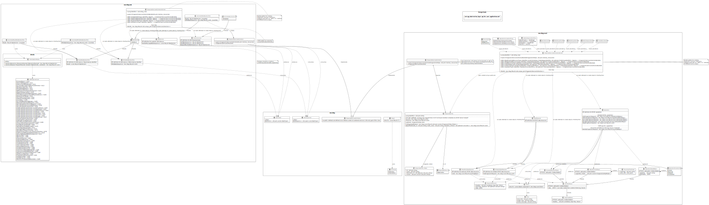

# C++ Diagnostic API Layer - Application Usage

This API layer provides application-facing abstractions for UDS and SOVD diagnostics.
Applications implement service/resource/operation interfaces and register them via builder classes.
The resulting `DiagnosticServicesCollection` controls lifetime and hence keeps the implemented application
functionality connected to the underlying binding.

## Design Goals

 - This API Layer acts as abstraction layer between user code and a concrete binding implementation which communicates with the SOVD Server.
   - guarantees clear independence from underlying implementation details and thus, facilitates easy unit-testability of user code
   - concrete implementation of the underlying binding can get easily exchanged as well as adjusted if required without having to adjust all the user code

<br>

 - This API layer should have certain pieces of information available to be able to, if required, forward such data to the SOVD Server for further processing there.
   - as a result, user code must provide certain pieces of information as depicted by this design upon registration of SOVD Operations and/or Data Resources

<br>

 - user code shall have minimal hassle w.r.t. to creating as well as having to populate native SOVD reply payloads
   - ideally, the API layer itself shall create native SOVD data structures (namely JSON) and populate these from the user-provided data structures implicitly

<br>

 - user code which is still using legacy UDS APIs shall seamlessly continue to work as before
   - such user code can then get migrated step-wise to new SOVD APIs which eases system migration to the new OpenSOVD stack

<br>

 - newly written applications shall not use the legacy UDS APIs but the native SOVD ones instead

## Diagrams


A [PlantUML version](./cpp_abstraction_layer_api_for_user_applications.puml) is also available.

<br>

## Note on implementation of bindings

Since there will also be Rust bindings for this API layer, duplicate implementation code shall be avoided.
This reduces implementation as well as future maintenance efforts. Instead, it is desired to have the C++
bindings to be implemented as wrappers around the Rust bindings (e.g. by utilizing a Rust FFI bridge).

## Coding Examples

### SOVD: ReadOnlyDataResource

```cpp
#include "mw/diag/sovd/sovd.hpp"  // illustrative include

#include <memory_resource>

class VehicleInfoResource final : public mw::diag::sovd::ReadOnlyDataResource
{
  public:
    explicit VehicleInfoResource(std::pmr::memory_resource& memory_resource) : memory_resource_{memory_resource} {}

    mw::diag::sovd::Result<mw::diag::sovd::JsonDataReply> Get() override
    {
        mw::diag::sovd::JsonDataReply reply{memory_resource_};
        // reply.set({{"vin", "FOO BAR"}});  // illustrative JSON
        return {std::move(reply)};
    }

  private:
    std::pmr::memory_resource& memory_resource_;
};

mw::diag::Result<score::cpp::pmr::unique_ptr<mw::diag::DiagnosticServicesCollection>>
RegisterVehicleInfoResourceFor(mw::diag::sovd::DiagnosticEntity& entity,
                               mw::diag::sovd::JsonSchemaView json_schema,
                               std::pmr::memory_resource& memory_resource)
{
    return mw::diag::sovd::DiagnosticServicesCollectionBuilder{entity, memory_resource}
            .With<VehicleInfoResource>({"common/VehicleInfoResource"},
                                       schema,
                                       mw::diag::sovd::DataCategoryIdentifiers::kSysInfo,
                                       std::nullopt)  // note that `With()` will implicitly forward the builder's memory_resource to `VehicleInfoResource`
            .Build();
}
```

<br>

### SOVD: WritableDataResource

```cpp
#include "mw/diag/sovd/sovd.hpp"  // illustrative include

#include <memory_resource>

class ConfigResource final : public mw::diag::sovd::WritableDataResource
{
  public:
    explicit ConfigResource(std::pmr::memory_resource& memory_resource) : memory_resource_{memory_resource} {}

    mw::diag::sovd::Result<void> Put(mw::diag::sovd::DiagnosticRequest request) override
    {
        // parse `request.data` and persist it here as required by your needs

        return {};
    }

  private:
    std::pmr::memory_resource& memory_resource_;
};

mw::diag::Result<score::cpp::pmr::unique_ptr<mw::diag::DiagnosticServicesCollection>>
RegisterConfigResourceFor(mw::diag::sovd::DiagnosticEntity& entity, std::pmr::memory_resource& memory_resource)
{
    return mw::diag::sovd::DiagnosticServicesCollectionBuilder{entity, memory_resource}
            .With<ConfigResource>({"MyApplication/MyComponent/Configure"},
                                  mw::diag::sovd::DataCategoryIdentifiers::kParameter,
                                  std::nullopt)  // note that `With()` will implicitly forward the builder's memory_resource to `ConfigResource`
        .Build();
}
```

<br>

### SOVD: Operations

```cpp
#include "mw/diag/sovd/sovd.hpp"  // illustrative include

#include <memory_resource>

// synchronous operation
class SelfTestOperation final : public mw::diag::sovd::Operation
{
  public:
    explicit SelfTestOperation(std::pmr::memory_resource& memory_resource) : memory_resource_{memory_resource} {}

    mw::diag::sovd::Result<mw::diag::sovd::OperationInfoReply> Info(mw::diag::sovd::DiagnosticRequest) override { return {}; }
    mw::diag::sovd::Result<mw::diag::sovd::OperationStatusReply> Status(mw::diag::sovd::DiagnosticRequest) override { return {}; }

    mw::diag::sovd::Result<mw::diag::sovd::ExecuteOperationReply> Execute(mw::diag::sovd::DiagnosticRequest) override
    {
        // perform operation in place here (=> synchronously)

        return {};
    }

    mw::diag::sovd::Result<mw::diag::sovd::ExecuteOperationReply> Resume(mw::diag::sovd::DiagnosticRequest) override { return {}; }
    mw::diag::sovd::Result<mw::diag::sovd::ExecuteOperationReply> Reset(mw::diag::sovd::DiagnosticRequest) override { return {}; }
    mw::diag::sovd::Result<void> Stop(mw::diag::sovd::DiagnosticRequest) override { return {}; }

  private:
    std::pmr::memory_resource& memory_resource_;
};

// asynchronous operation
class LongRunningOperation final : public mw::diag::sovd::Operation
{
  public:
    explicit LongRunningOperation(std::pmr::memory_resource& memory_resource) : memory_resource_(memory_resource) {}

    mw::diag::sovd::Result<mw::diag::sovd::OperationInfoReply> Info(mw::diag::sovd::DiagnosticRequest) override { return {}; }
    mw::diag::sovd::Result<mw::diag::sovd::OperationStatusReply> Status(mw::diag::sovd::DiagnosticRequest) override
    {
        // return current progress/status
        return {};
    }

    mw::diag::sovd::Result<mw::diag::sovd::ExecuteOperationReply> Execute(mw::diag::sovd::DiagnosticRequest) override
    {
        // trigger async work here and return initial response
        return {};
    }

    mw::diag::sovd::Result<mw::diag::sovd::ExecuteOperationReply> Resume(mw::diag::sovd::DiagnosticRequest) override { return {}; }
    mw::diag::sovd::Result<mw::diag::sovd::ExecuteOperationReply> Reset(mw::diag::sovd::DiagnosticRequest) override { return {}; }
    mw::diag::sovd::Result<void> Stop(mw::diag::sovd::DiagnosticRequest) override { return {}; }

  private:
    std::pmr::memory_resource& memory_resource_;
};

mw::diag::Result<score::cpp::pmr::unique_ptr<mw::diag::DiagnosticServicesCollection>>
RegisterOperationsFor(mw::diag::sovd::DiagnosticEntity& entity, std::pmr::memory_resource& memory_resource)
{
    return mw::diag::sovd::DiagnosticServicesCollectionBuilder{entity, memory_resource}
            .With<SelfTestOperation>({"MyApplication/MyComponent/PerformSelfTest"},
                                     mw::diag::sovd::OperationInvocationPolicy::kPerformsSynchronousInvocation,
                                     std::nullopt)  // note that `With()` will implicitly forward the builder's memory_resource to `SelfTestOperation`
            .With<LongRunningOperation>({"MyApplication/MyComponent/PerformLongRunningTask"},
                                        mw::diag::sovd::OperationInvocationPolicy::kRequiresIndividualAsyncInvocations,
                                        std::nullopt)  // note that `With()` will implicitly forward the builder's memory_resource to `LongRunningOperation`
            .Build();
}
```

<br>

### UDS: ReadDataByIdentifier

```cpp
#include "mw/diag/uds/uds.hpp"  // illustrative include

#include <memory_resource>

class VinReader final : public mw::diag::uds::ReadDataByIdentifier
{
  public:
    explicit VinReader(std::pmr::memory_resource& memory_resource) : memory_resource_{memory_resource} {}

    mw::diag::Result<ByteVector> Read() override
    {
        ByteVector bytes{&memory_resource_};
        bytes.insert(bytes.end(), {0x56, 0x49, 0x4E});  // "VIN" bytes, example only
        return {std::move(bytes)};
    }

  private:
    std::pmr::memory_resource& memory_resource_;
};

mw::diag::Result<score::cpp::pmr::unique_ptr<mw::diag::DiagnosticServicesCollection>>
RegisterVinReader(std::pmr::memory_resource& memory_resource)
{
    return mw::diag::uds::DiagnosticServicesCollectionBuilder{memory_resource}
            .With<VinReader>({"0xF190"})  // note that `With()` will implicitly forward the builder's memory_resource to `VinReader`
            .Build();
}
```

<br>

### UDS: WriteDataByIdentifier

```cpp
#include "mw/diag/uds/uds.hpp"  // illustrative include

#include <memory_resource>

class ConfigWriter final : public mw::diag::uds::WriteDataByIdentifier
{
  public:
    explicit ConfigWriter(std::pmr::memory_resource& memory_resource) : memory_resource_{memory_resource} {}

    mw::diag::Result<void> Write(mw::diag::ByteSequence data) override
    {
        // parse and persist `data` here

        return {};
    }

  private:
    std::pmr::memory_resource& memory_resource_;
};

mw::diag::Result<score::cpp::pmr::unique_ptr<mw::diag::DiagnosticServicesCollection>>
RegisterConfigWriter(std::pmr::memory_resource& memory_resource)
{
    return mw::diag::uds::DiagnosticServicesCollectionBuilder{memory_resource}
            .With<ConfigWriter>({"0xF191"})  // note that `With()` will implicitly forward the builder's memory_resource to `ConfigWriter`
            .Build();
}
```

<br>

### UDS: SerializedWriteDataByIdentifier

```cpp
#include "lib/serialization/serializer.h"

#include "mw/diag/uds/uds.hpp"  // illustrative include

#include <memory_resource>

struct MyConfigData
{
    std::size_t num_ids;
    std::pmr::vector<IdType> data_ids;
}

// helper macro from 'lib/serialization/serializer.h' which facilitates
// automatic deserialization of a byte sequence into `MyConfigData`
STRUCT_VISITABLE(RequestPayload, num_ids, data_ids)

class ConfigWriter final : public mw::diag::uds::SerializedWriteDataByIdentifier<ConfigWriter>
{
  public:
    explicit ConfigWriter(std::pmr::memory_resource& memory_resource) : memory_resource_{memory_resource} {}

    mw::diag::Result<void> SerializedWrite(const RequestPayload& request_payload) override
    {
        // NOTE: There is no more need to parse the received byte sequence here since that
        //       got already performed by our base class `SerializedWriteDataByIdentifier`.
        DoSomethingWith(request_payload);

        return {};
    }

  private:
    std::pmr::memory_resource& memory_resource_;
};

mw::diag::Result<score::cpp::pmr::unique_ptr<mw::diag::DiagnosticServicesCollection>>
RegisterConfigWriter(std::pmr::memory_resource& memory_resource)
{
    return mw::diag::uds::DiagnosticServicesCollectionBuilder{memory_resource}
            .With<ConfigWriter>({"0xF191"})  // note that `With()` will implicitly forward the builder's memory_resource to `ConfigWriter`
            .Build();
}
```

**NOTE**: In a similar manner, `mw::diag::uds::SerializedReadDataByIdentifier` can get utilized.

<br>

### UDS: RoutineControl

```cpp
#include "mw/diag/uds/uds.hpp"  // illustrative include

#include <memory_resource>

class MyRoutine final : public mw::diag::uds::RoutineControl
{
  public:
    explicit MyRoutine(std::pmr::memory_resource& memory_resource) : memory_resource_{memory_resource} {}

    mw::diag::Result<ByteVector> Start(ByteSequence request) override
    {
        // implement your logic for start routine here

        ByteVector bytes{&memory_resource_};
        bytes.push_back(0x00);
        return {std::move(bytes)};
    }

    mw::diag::Result<ByteVector> Stop(ByteSequence request) override
    {
        // implement your logic for stop routine here

        ByteVector bytes{&memory_resource_};
        bytes.push_back(0x00);
        return {std::move(bytes)};
    }

    mw::diag::Result<ByteVector> RequestResults(ByteSequence request) override
    {
        // implement your logic for request routine results here

        ByteVector bytes{memory_resource_};
        bytes.insert(bytes.end(), {0x12, 0x34});
        return {std::move(bytes)};
    }

  private:
    std::pmr::memory_resource& memory_resource_;
};

mw::diag::Result<score::cpp::pmr::unique_ptr<mw::diag::DiagnosticServicesCollection>>
RegisterMyRoutine(std::pmr::memory_resource& memory_resource)
{
    return mw::diag::uds::DiagnosticServicesCollectionBuilder{memory_resource}
            .With<MyRoutine>({"0xFF00"})  // note that `With()` will implicitly forward the builder's memory_resource to `MyRoutine`
            .Build();
}
```
